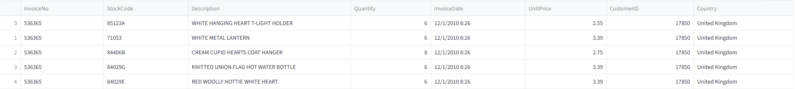
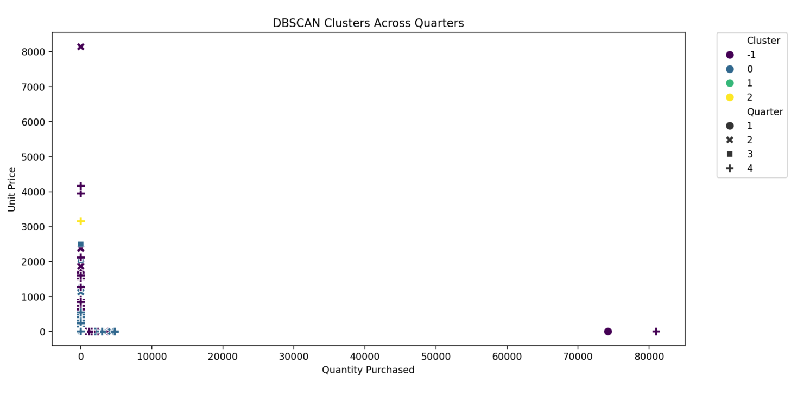

# 🛍️ Seasonal Customer Segmentation using DBSCAN (Streamlit App)

This project performs **customer segmentation** using **DBSCAN Clustering**, incorporating **seasonal buying patterns**.  
It builds an interactive **Streamlit web app** for visual analysis, comparison with K-Means, and business insights.

It helps businesses understand different types of customers like:
- 🟥 VIP customers (High spenders, frequent buyers)  
- 🟦 Thrifty customers (Low spenders, occasional buyers)  
- 🟪 Impulsive buyers (High spenders, infrequent buyers)  
- 🟩 Careful customers (Low spenders, frequent buyers)  

---

## 📌 Objective

🎯 To segment customers into meaningful clusters using **DBSCAN** with seasonal analysis.  
The tool allows:
- Marketing teams to design **targeted campaigns** by season  
- Businesses to **personalize offers** for VIP or seasonal buyers  
- Analysts to **explore purchase patterns** over quarters and seasons  

**LIVE Demo:** *(replace with your deployed app link if available)*  
https://your-app-link.streamlit.app/

---

## 🚀 Features

✅ Upload your own **Online Retail dataset** (CSV/Excel)  
✅ Data cleaning and RFM feature engineering  
✅ Seasonal & quarterly analysis (Winter, Summer, Spring, Fall)  
✅ Compare **K-Means vs DBSCAN** clusters  
✅ Dynamic scatter plots with cluster colors  
✅ Auto-generated **business insights** per cluster  
✅ Download cluster results for further analysis  

---

## 🧪 Technologies Used

| Tool / Library     | Purpose                                  |
|--------------------|-----------------------------------------|
| Python             | Main programming language               |
| Pandas             | Data analysis & cleaning                |
| Numpy              | Numeric calculations                     |
| Matplotlib         | Visualizations                           |
| Seaborn            | Cluster scatter plots                     |
| Scikit-learn       | DBSCAN & K-Means clustering              |
| Streamlit          | Interactive web app UI                   |
| StandardScaler     | Feature scaling                          |

---

## 📊 Dataset Overview

We use the [UCI Online Retail Dataset](https://archive.ics.uci.edu/dataset/352/online+retail), containing:

| Column         | Description                                         |
|----------------|-----------------------------------------------------|
| InvoiceNo      | Invoice number                                      |
| StockCode      | Product/item code                                   |
| Description    | Product description                                 |
| Quantity       | Number of items purchased                           |
| InvoiceDate    | Date of purchase                                    |
| UnitPrice      | Price per item                                      |
| CustomerID     | Unique customer identifier                           |
| Country        | Customer’s country                                  |

---

## 🖼️ How It Works

1. Upload the CSV or Excel file of the retail dataset  
2. Features like **Recency, Frequency, Monetary (RFM)** are automatically computed  
3. **Seasonal and quarterly features** are generated from InvoiceDate  
4. Select **K-Means** or **DBSCAN**:  
   - **K-Means** shows clusters but may misclassify seasonal or outlier customers  
   - **DBSCAN** detects irregular clusters and outliers effectively  
5. View **side-by-side scatter plots** for K-Means vs DBSCAN  
6. Auto-generated **business insights** with customer type and seasonal suggestions  
7. Export DBSCAN results as CSV for further use  

---

## 🖼️ Screenshots

### Dataset Preview

### K-Means vs DBSCAN Clusters

### Seasonal Customer Insights

### Export Results

---

## Author

- Afsar Uddin 💼 Aspiring Software Engineer | 🌏 Bangladesh 📧 Email: afsaruddin12133@gmail.com
---

## License

This project is licensed under the MIT License.
